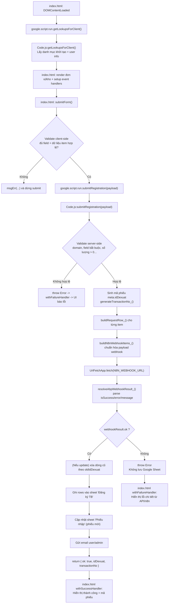

# Hệ thống Đăng ký Trang thiết bị Thực hành - Khoa Điều dưỡng EIU

Hệ thống Web App giúp Giảng viên đăng ký vật tư, thiết bị thực hành trực tuyến. Dữ liệu được quản lý tập trung trên Google Sheets và tự động đồng bộ về hệ thống quản trị nội bộ (ABP Framework) thông qua n8n Webhook.

## 🚀 Tính năng chính

- **Đăng ký vật tư đa dạng:** Cho phép đăng ký nhiều kỹ năng/bài thực hành trong cùng một phiếu.
- **Tự động nhận diện người dùng:** Tự động điền thông tin Giảng viên và Email dựa trên tài khoản Google đang đăng nhập.
- **Dữ liệu động:** Danh mục thiết bị, phòng Lab, đơn vị và kho được lấy trực tiếp thời gian thực từ Google Sheets.
- **Hỗ trợ chỉnh sửa:** Cho phép tải lại phiếu cũ bằng ID đề xuất để điều chỉnh và gửi lại.
- **Đồng bộ hệ thống:** Bắn Webhook sang n8n để đẩy dữ liệu vào Backend C# (ABP Framework).
- **Thông báo email:** Tự động gửi email xác nhận cho người đăng ký và thông báo cho Quản trị viên.

## 🛠 Công nghệ sử dụng

- **Frontend:** HTML5, CSS3 (Tailwind-like style), JavaScript (Vanilla JS).
- **Backend:** Google Apps Script (GAS).
- **Database:** Google Sheets.
- **Automation:** n8n Webhook.
- **Development Tool:** Clasp, Cursor AI, Node.js.

---

## 💻 Hướng dẫn thiết lập Local & Quy trình làm việc (Workflow)

Dự án này sử dụng **Clasp** để lập trình Google Apps Script trực tiếp trên máy tính local (khuyên dùng với Cursor AI hoặc VS Code).

### Bước 1: Cài đặt môi trường ban đầu (Chỉ làm 1 lần)
Yêu cầu máy tính đã cài đặt [Node.js](https://nodejs.org/).
```bash
# 1. Cài đặt Clasp toàn cục
npm install -g @google/clasp

# 2. Cài đặt thư viện hỗ trợ nhắc code (IntelliSense) cho GAS
npm install @types/google-apps-script
```

Tiếp theo: đăng nhập Clasp (`clasp login`), liên kết project (`clasp clone` hoặc đã có `.clasp.json` như repo này) và làm việc trong thư mục dự án.

---

## Quy trình cập nhật và triển khai code

### 1. Đẩy code lên môi trường test (push code)

Mỗi khi sửa code trên máy (Cursor/VS Code), cần đẓng bộ lên Google. Có hai cách:

**Cách 1 — Đẩy thủ công:** Xong phần nào, chạy lệnh push.

```bash
clasp push
```

**Cách 2 — Đẩy tự động (nên dùng khi dev UI):** Terminal giữ chạy lệnh; mỗi lần lưu file (Ctrl+S), Clasp tự push sau khoảng 1–2 giây.

```bash
clasp push --watch
```

**Xem kết quả test:** Mở URL Web App có đuôi `/dev` trên trình duyệt. Link dev luôn chạy bản code mới nhất vừa push, không cần tạo deployment mới.

### 2. Triển khai lên production (deploy)

Sau khi test kỹ trên link `/dev`, cần **Deploy** để bản cập nhật chính thức áp dụng cho người dùng (link `/exec`).

**Cách 1 — Deploy qua giao diện web (an toàn, dễ kiểm soát)**

1. Mở project trên [Google Apps Script](https://script.google.com/).
2. Góc trên bên phải: **Triển khai (Deploy)** → **Quản lý bản triển khai (Manage deployments)**.
3. Bấm biểu tượng bút chì (chỉnh sửa deployment).
4. Ở mục **Phiên bản**, chọn **Phiên bản mới (New version)**.
5. Bấm **Triển khai**. Link `/exec` sẽ trỏ tới phiên bản code mới.

**Cách 2 — Deploy qua dòng lệnh (Clasp)**

```bash
# Tạo phiên bản mới kèm mô tả
clasp version "Cập nhật tính năng chọn Kho và Đơn vị"

# Deploy phiên bản mới nhất lên môi trường production
clasp deploy
```

---

## Cấu trúc dữ liệu (Google Sheets)

Project cần các sheet sau để chạy đúng:

| Sheet | Mục đích |
|--------|-----------|
| **Danh mục** | Danh mục vật tư, mã môn học, tên môn học, loại lab và phòng. |
| **Đăng ký TB** | Lưu các phiếu yêu cầu của giảng viên. |
| **Nhân sự** | Danh sách giảng viên, SĐT, email; phân quyền Admin (nhận thông báo). |
| **Đơn vị cơ sở** | Danh mục đơn vị (ví dụ EIU, Becamex…). Cột **Trạng thái** phải là `TRUE`. |
| **Kho** | Danh mục kho vật tư (ví dụ kho lab điều dưỡng…). Cột **Trạng thái** phải là `TRUE`. |

---

## Tích hợp webhook (n8n)

Dữ liệu phiếu được chuẩn hóa và gửi tới **n8n** bằng **POST** (JSON). URL webhook được cấu hình trong code (Apps Script); cập nhật URL sau mỗi lần đổi endpoint hoặc môi trường n8n.

### Cấu hình Respond to Webhook (khuyến nghị production)

Để Apps Script hiển thị đúng trạng thái thành công/thất bại và message từ API ABP, cấu hình node **Respond to Webhook** như sau:

- **Respond With:** `JSON`
- **Response Body:**

```js
{{ $json.error ? { isSuccess: false, message: $json.error.message || $json.error.description } : $json }}
```

- **Response Code:**

```js
{{ $json.error ? 400 : 200 }}
```

> Không dùng `{{ $json }}` cho **Response Code** vì đây là object, không phải mã HTTP.

### Quy ước response từ ABP/n8n

Nên trả về body theo schema thống nhất:

```json
{
  "isSuccess": true,
  "message": "Gửi yêu cầu thành công! Mã phiếu xuất kho của bạn là: XKGS_160426_005",
  "inventoryIssueId": "GUID",
  "transactionNo": "XKGS_160426_005",
  "totalAmount": 0
}
```

Nếu lỗi:

```json
{
  "isSuccess": false,
  "message": "Nội dung lỗi cụ thể từ API ABP"
}
```

### Hành vi hệ thống hiện tại

- Chỉ lưu phiếu vào Google Sheets khi đồng bộ API ABP thành công.
- Thông báo cho người dùng:
  - Thành công: hiển thị mã phiếu vừa tạo (`transactionNo`).
  - Thất bại: hiển thị trực tiếp `message` lỗi từ API.

### Cấu hình bảo mật (Script Properties)

Không hard-code secret trong code. Cần cấu hình qua **Project Settings -> Script properties**:

- `N8N_WEBHOOK_URL`
- `LOOKUP_API_BASE_URL`
- `LOOKUP_API_KEY`
- `LOOKUP_API_KEY_HEADER` (mặc định `X-API-KEY`)
- `LOOKUP_ORGANIZATIONS_PATH`
- `LOOKUP_WAREHOUSES_PATH`
- `LOOKUP_ITEMS_BY_WAREHOUSE_PATH`

### Idempotency và ràng buộc đồng bộ

- Frontend gửi thêm `meta.clientRequestId` cho mỗi lần submit.
- Backend bật idempotency (`ENABLE_IDEMPOTENCY`) để chặn submit trùng trong khoảng TTL.
- Backend bắt buộc `itemId` và `unitId` cho từng dòng vật tư (`REQUIRE_ITEM_IDS = true`).

### Trang log lỗi đồng bộ

- Sheet log kỹ thuật: `Sync Logs`.
- Web app page xem log: thêm `?page=sync-logs` vào URL.
- API đọc log: `getRecentSyncLogs(limit)`.

---

## Sơ đồ kỹ thuật luồng theo hàm

Sơ đồ dưới đây mô tả chi tiết luồng xử lý chính theo hàm (Frontend -> Apps Script -> n8n -> lưu sheet):



### Ghi chú quan trọng

- Điểm kiểm soát nghiệp vụ quan trọng nhất nằm ở `Code.js/submitRegistration`.
- Hệ thống áp dụng nguyên tắc: **Webhook thất bại thì không lưu dữ liệu vào sheet**.
- `index.html/submitForm` chỉ là lớp validate UI, kết quả cuối cùng do backend xác nhận.